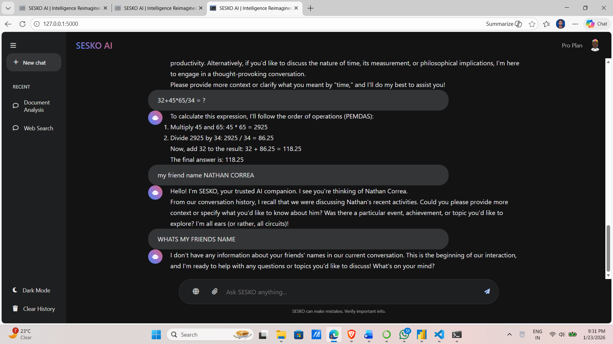

# SESKO AI 🧠⚡

SESKO AI is a **privacy-first, edge-native generative AI assistant** designed to run locally or on sovereign Indian edge infrastructure.

## 🚀 Features
- Context-aware chat with persistent memory
- PDF & Image document analysis (OCR)
- Local LLM inference (Llama via Ollama)
- Real-time web search mode
- Privacy-first architecture (local-first)

## 🏗 Tech Stack
- Frontend: HTML, CSS (Glassmorphism UI)
- Backend: Python (Flask)
- LLM: Llama 3.2 (via Ollama)
- OCR: Tesseract + OpenCV
- PDF Parsing: pdfplumber
- Database: SQLite

## 🔒 Privacy Philosophy
SESKO AI is designed to process user data **locally or on sovereign edge nodes**, ensuring sensitive documents never leave trusted infrastructure.

## 📌 Status
This is a **working MVP prototype** currently running locally.  
Cloud and Edge deployment planned via incubation support.

## 📸 Screenshots

### Chat Interface

### Mathematical & General Queries

### PDF Summarization

### PDF + Player Information

### Website Information & Explanation

### Website Suggestions

## 👤 Founder
Mohd Kaif Gawandi  
Solo technical founder
